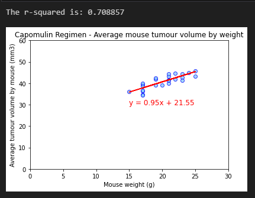

# Top level summary of potential treatments for squamous cell carcinoma

 ### **Overview**
Complete a top level summary of data from 249 mice who were identified with SCG tumors and received treatment with a range of drug regimens over a 45 day period.

Key aspects:
 - Read in the data
 - Combined the dataframes into one
 - Cleaned the data, including handling of duplicates
 - Produce summary statistics
 - Visualise the data in both pandas and matplotlib
 - Calculate the correlation coefficient and linear regression
 
 
 

------------------------------------------------------------------------

### **Contact:**
Email: kymcoleman@gmail.com

------------------------------------------------------------------------
 

***Folder structure***

- **'script.ipynb'** contains the code and output
